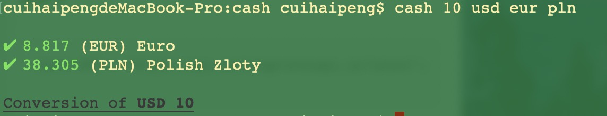

# cash

> Calculate the exchange rate of the currency

## Introduction
Calculate the exchange rate between the 
'from' currency and the 'to' currency of 
other countries.

You can set the 'from' 
currency and the 'to' currency,if not the defaultFrom 
is USD ,and the defaultTo is ['USD', 'EUR', 'GBP', 'JPY'].


## Installation
<ol>
<li>Clone your forked repository project `https://github.com/chp1995/3-musketeers`

```sh
❯ cd /path/to/workspace
❯ git clone git@github.com:chp1995/3-musketeers.git
```
</li>

<li>Enter the cash directory and configure the environment

```sh
❯ npm install
❯ cd /path/to/workspace/3-musketeers/cash
❯ npm i
```
</li>
</ol>

## Usage
<ol>
<li>Start 

You can start the project by the code:

```sh
❯ node bin/index.js
```
But if you think it's not convinient,you can try:

```sh
❯ npm link
```
Now you can use the following code to start the project:

```sh
❯ cash
```

Then you can see the exchange rate of the us dollar against the other three currencies.

</li>

<li>But the function is not such simple.You can also 
change the 'from' currency, the 'to' currency,and even the amount
of the money.

```sh
❯ cash <amount> <from> <to> 
```
For example:

```sh
❯ cash 10 usd eur pln
```

</li>

<li>And you can also set the defult currency:

```sh
❯ cash --set -s
```
For example:

```sh
❯ cash --set cny aud
```

</li>

<li>If you need some help,you can type:

```sh
❯ cash --help
```

</li>
</ol>


##API

```js
const API = 'https://api.exchangeratesapi.io/latest';
```
The return result is a json file like this:
```
{"base":"EUR","date":"2019-02-20","rates":{"NZD":1.6513,"CAD":1.4956,"MXN":21.7301,"AUD":1.5844,"CNY":7.6244,"PHP":59.003,"GBP":0.86945,"CZK":25.679,"USD":1.1342,"SEK":10.5703,"NOK":9.7335,"TRY":6.019,"IDR":15924.17,"ZAR":16.0354,"MYR":4.6183,"HKD":8.9026,"HUF":317.33,"ISK":135.7,"HRK":7.4135,"JPY":125.61,"BGN":1.9558,"SGD":1.5326,"RUB":74.5774,"RON":4.7567,"CHF":1.1342,"DKK":7.4614,"INR":80.7035,"KRW":1273.47,"THB":35.268,"BRL":4.2019,"PLN":4.3445,"ILS":4.1004}}
```

##Module
###index.js
The program's entry file is used to parse user commands and feedback
###constant.js
Set the API and set the defaults
###cash.js
Used by cash.js call, and call constant.js to calculate and return the result

## Licence

[Uncopyrighted](http://zenhabits.net/uncopyright/)
